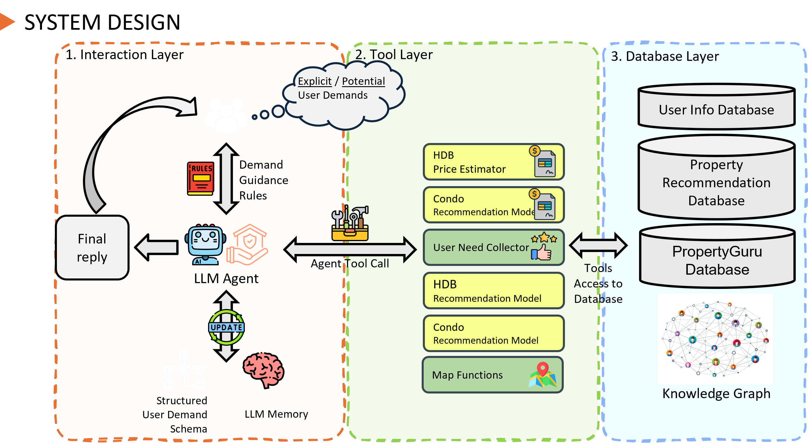

# ISY5001-Workshop-Project-Submission-Group16-PropertyAI

Course: ISY-5001 Intelligent Reasoning Systems (IRS)

Project Name: Property AI Assistant

Submission Type: Final Report

Team: Group 16

---

## SECTION 1 : PROJECT TITLE

Property AI Assistant — An Intelligent Reasoning System for Singapore Real Estate

---

## SECTION 2 : EXECUTIVE SUMMARY / PAPER ABSTRACT

Singapore’s residential market involves high-stakes, policy-constrained decisions. This project delivers an intelligent, rule-aware assistant that unifies: (i) a price estimator for HDB and private properties, (ii) a policy/finance engine for TDSR, MSR, LTV, BSD, ABSD, and SSD, and (iii) an amenity-aware recommendation model. The system combines an XGBoost estimator for price prediction, a LightGBM (LambdaMART) ranker for personalized recommendations, and an LLM agent that orchestrates data, tools, and explanations. By integrating government-verified datasets (HDB/URA/OneMap) with geospatial features and user preference matrices, the assistant reduces uncertainty, accelerates decision-making, and improves transparency for buyers, sellers, upgraders, and advisors. Outputs include entry/exit price forecasts with confidence bands, policy-compliant affordability checks, ranked recommendations, and spatial visualizations (routes, POIs, accessibility), all explained through an interpretable, conversational interface.

---

## SECTION 3 : CREDITS / PROJECT CONTRIBUTION

| Name | Student ID | Summary of Contributions |
| :-- | :--: | :-- |
| Cheng Ziming | A0330176L | Ideation; high-level architecture; core codebase; LangGraph + Agent framework |
| Hong Zhuoyuan | A0329586L | Ideation; HDB/Condo estimator pipelines; postal code–address map; frontend + integration |
| Jia XingJie | A0139137A | Data cleaning/FE; analysis; price model optimization; video editing |
| Thun Zhen Hong | A0331639B | Condo recommender (baseline/final); evaluation; user matrix → similarity for ranking |
| Wang Yaochen | A0241873B | Geo-feature enrichment; recommendation architecture + HDB model; OneMap route function; docs |

---

## SECTION 4 : VIDEO OF SYSTEM MODELLING & USE CASE DEMO

See repository folder: `Video/`.

---

## SECTION 5 : USER GUIDE

Refer to appendix “Installation & User Guide” in project report at `ProjectReport/`.

Quick start (optional, for local runs):

1) Frontend (Vite + React)

- Path: `SystemCode/src/frontend/RealEstateRecommendationSystem`
- Commands: `npm install` then `npm run dev`

2) Backend (agents, models, tools)

- Path: `SystemCode/src/backend/agent`
- Commands: `pip install -r SystemCode/src/requirements.txt` then `python app.py`
- Alternative entry: `python app_backend_test.py`

3) Data & Models

- Data: `SystemCode/data/`
- Models/artifacts: `SystemCode/src/backend/models/`
- From `https://drive.google.com/drive/folders/18Atcs--U4xUOdUbMIAYF_e_vhfwQ12w6?usp=sharing`, download "item_matrix_merged.csv" and "item_matrix_merged_condo_reordered_20251019_180809.csv" and place them into `SystemCode/data/`.

---

## SECTION 6 : PROJECT REPORT / PAPER

Refer to project report at repository folder: `ProjectReport/`.

1. Introduction  
2. Project Background & Market Context  
3. Literature Review & Market Research  
4. Project Scope  
5. Data Collection and Preparation  
6. System Design  
7. Implementation  
8. Results & Progress  
9. Challenges & Roadblocks  
10. Future Work  
11. Conclusion  
12. References

---

### References (selected)

- 99.co (2025). Property Value Tool — Powered by SRX X-Value. `https://www.99.co/singapore/property-value-tool`
- Doshi-Velez, F., & Kim, B. (2017). Towards a rigorous science of interpretable ML. `https://doi.org/10.48550/arXiv.1702.08608`
- EdgeProp Singapore. Edge Fair Value and Deal Checker. `https://www.edgeprop.sg/analytic/edgefairvalue` `https://www.edgeprop.sg/gooddealnew`
- Gunning, D., & Aha, D. W. (2019). DARPA XAI. `https://ojs.aaai.org/aimagazine/index.php/aimagazine/article/view/2850`
- HDB (2024–2025). Policies, RPI, HFE. `https://www.hdb.gov.sg/`
- IRAS (2023–2025). BSD, ABSD, SSD. `https://www.iras.gov.sg/`
- MAS (2021). TDSR/MSR rules. `https://www.mas.gov.sg/`
- MND (n.d., 2023). New flat classification framework. `https://www.mnd.gov.sg/`
- OneMap API (SLA). Docs and overview. `https://www.onemap.gov.sg/docs/` `https://geoworks.sla.gov.sg/`
- PropertyGuru (2025). My Home valuation. `https://www.propertyguru.com.sg/my-home`
- Sharma, H., Harsora, H., & Ogunleye, B. (2024). XGBoost for house prices. `https://arxiv.org/abs/2402.04082`
- SRX X-Value. `https://www.srx.com.sg/xvalue-pricing`
- URA (2025). Q2 2025 statistics. `https://www.ura.gov.sg/`

Complete bibliography is provided in the ProjectReport.

---

This Machine Reasoning (MR) course is part of the Analytics and Intelligent Systems and Graduate Certificate in Intelligent Reasoning Systems (IRS) series offered by NUS-ISS (Institute of Systems Science, National University of Singapore).
